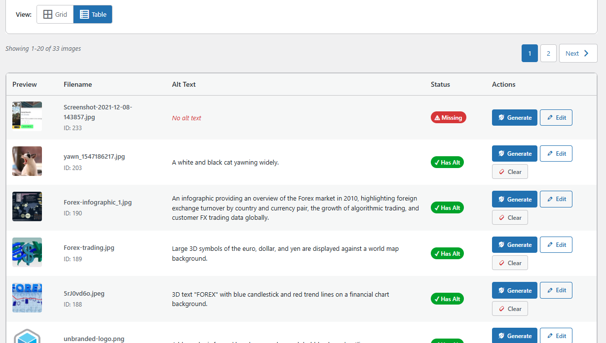
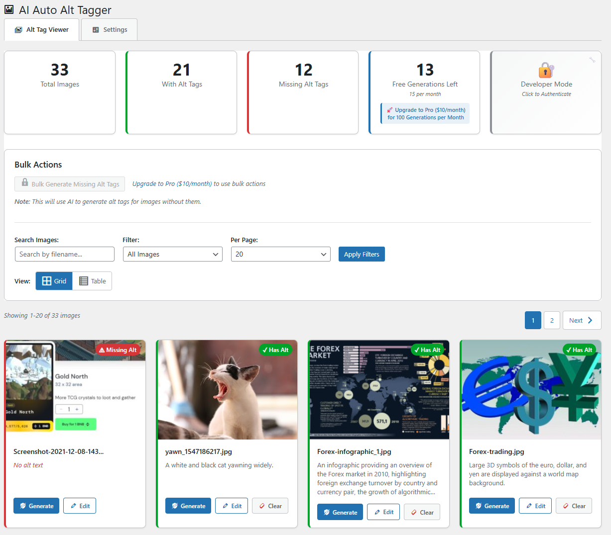

# Auto Image Alt Text Generator For SEO


> Automatically generate AI-powered alt text for WordPress images. Improve SEO, boost accessibility, and save hours with bulk or on-demand generation.

---

## 🚀 Features

- **🪄 Bulk Generation** - Process multiple images at once with AI-powered alt text generation
- **⚡ On-Demand Generation** - Generate alt text for individual images with a single click
- **🧠 AI-Powered** - Uses advanced AI to understand image content and generate accurate descriptions
- **📊 Alt Text Viewer** - Comprehensive dashboard to view and manage all your image alt text
- **🔍 Smart Search & Filters** - Quickly find images missing alt text
- **📱 Grid & Table Views** - Choose your preferred visualization
- **♿ WCAG Compliant** - Meet accessibility standards automatically
- **🎯 SEO Optimized** - Improve search engine rankings with descriptive alt text

## 📦 Installation

### From WordPress.org (Recommended)

1. In your WordPress admin panel, go to **Plugins > Add New**
2. Search for "Auto Image Alt Text Generator For SEO"
3. Click **Install Now** and then **Activate**

### From GitHub

1. Download the [latest release](https://github.com/DigiHatrix/Auto-Image-Alt-Text-Generator-For-SEO-wp/releases)
2. Upload the plugin folder to `/wp-content/plugins/`
3. Activate the plugin through the WordPress 'Plugins' menu

### For Development

```bash
# Clone the repository
git clone https://github.com/DigiHatrix/Auto-Image-Alt-Text-Generator-For-SEO-wp.git

# Move to wp-content/plugins directory
mv hs-auto-image-alt-text-generator-for-seo /path/to/wordpress/wp-content/plugins/

# Activate via WP-CLI
wp plugin activate hs-auto-image-alt-text-generator-for-seo
```

## 🎯 Usage

1. After activation, go to **Auto Image Alt Text Generator For SEO** in your WordPress admin menu
2. View all your images with their current alt text status
3. Click **Generate** on individual images, or use **Bulk Generate** (Pro) for multiple images
4. Your images now have AI-generated alt text!

## 💎 Free vs Pro

| Feature               | Free      | Pro |
|---------              |------     |-----|
| AI Generations/Month  | 15        | 100 |
| Individual Generation | ✅        | ✅ |
| Bulk Generation       | ❌        | ✅ |
| Alt Text Viewer       | ✅        | ✅ |
| Search & Filters      | ✅        | ✅ |
| **Price**             | **Free**  | **$10/month** |

[Upgrade to Pro →](https://hatrixsolutions.com/auto-image-alt-text-generator-for-seo/)

## 📋 Licensing Note

This plugin is **free and open source** (GPL v2), meaning you're free to use, modify, and distribute the code. However, Pro features require a paid subscription to access our AI API services. The free tier includes 15 generations per month.

**What's free:**
- Plugin code (GPL licensed)
- 15 AI generations/month
- All viewer features

**What requires payment:**
- Additional AI generation quota (Pro: 100/month)
- Access to bulk generation features

## 🛠️ Requirements

- WordPress 5.0 or higher
- PHP 7.4 or higher
- Active internet connection (for AI processing)

## 📸 Screenshots


*Alt Text Viewer Dashboard - View all images with their alt text status*


*Bulk Generation in action (Pro feature)*

## 🔐 Privacy & Security

- ✅ Images processed via secure HTTPS API
- ✅ No images stored on external servers
- ✅ Alt text saved directly to WordPress database
- ✅ Fully compliant with WordPress coding standards
- ✅ No tracking or data collection

## 💬 Feedback & Suggestions

While this is a private repository and we're not accepting code contributions at this time, we absolutely welcome your feedback!

**Have an idea or found an issue?**
- 📧 Email us: support@hatrixsolutions.com
- 🌐 Submit feedback: [hatrixsolutions.com/support](https://hatrixsolutions.com/support)

Your input helps us improve the plugin for everyone!

## 📝 Changelog

### 0.1.0 - 2025-10-10

- 🎉 Initial release
- ✨ AI-powered alt text generation
- 📊 Alt text viewer with grid and table views
- 🔍 Search and filter functionality
- 💎 Free and Pro plans
- ♿ WCAG accessibility compliance

[View Full Changelog](CHANGELOG.md)

## 🐛 Report an Issue

Found a bug? Please contact our support team:
- 📧 support@hatrixsolutions.com
- 🌐 [Support Portal](https://hatrixsolutions.com/support)

Include:
- WordPress version
- PHP version
- Steps to reproduce
- Expected vs actual behavior

## 📄 License

This plugin is licensed under the GPLv2 or later.

```
Copyright (C) 2025 Hatrix Solutions

This program is free software; you can redistribute it and/or modify
it under the terms of the GNU General Public License as published by
the Free Software Foundation; either version 2 of the License, or
(at your option) any later version.

This program is distributed in the hope that it will be useful,
but WITHOUT ANY WARRANTY; without even the implied warranty of
MERCHANTABILITY or FITNESS FOR A PARTICULAR PURPOSE. See the
GNU General Public License for more details.
```

## 🔗 Links

- [WordPress.org Plugin Page](https://wordpress.org/plugins/hs-auto-image-alt-text-generator-for-seo/)
- [Documentation](https://hatrixsolutions.com/docs/auto-image-alt-text-generator)
- [Support](https://hatrixsolutions.com/support)
- [Hatrix Solutions](https://hatrixsolutions.com)

## 💬 Support

Need help? We're here for you:

- 📧 Email: support@hatrixsolutions.com
- 🌐 Website: [hatrixsolutions.com/support](https://hatrixsolutions.com/support)
- 📚 Documentation: [hatrixsolutions.com/docs](https://hatrixsolutions.com/docs)

---

Made with ❤️ by [Hatrix Solutions](https://hatrixsolutions.com)
